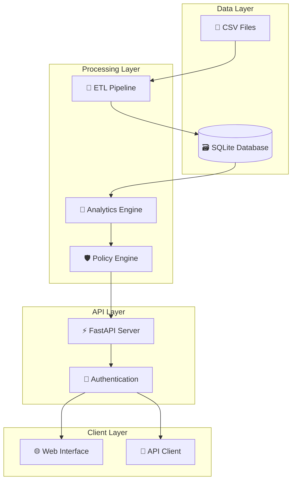

# MoatMetrics

<div align="center">
  <h3>🔒 Privacy-First Analytics Platform for MSPs</h3>
  <p><strong>Statistical Analytics • Human-in-the-Loop • Complete Data Control</strong></p>
  
  
  
  
  
  
</div>

---

## 📋 Table of Contents

- [🚀 Project Status](#-project-status)
- [🎯 Overview](#-overview)
- [🏗️ System Architecture](#️-system-architecture)
- [⚡ Quick Start](#-quick-start)
- [📊 Core Features](#-core-features)
- [📈 Analytics Capabilities](#-analytics-capabilities)
- [🛡️ Security & Compliance](#️-security--compliance)
- [📚 Documentation](#-documentation)
- [🎯 Use Cases](#-use-cases)
- [🔮 Future Roadmap](#-future-roadmap)
- [🤝 Contributing](#-contributing)
- [📄 License](#-license)
- [🙋‍♂️ Support](#️-support)
- [👨‍💼 Contact](#-contact)

---

## 🚀 **Project Status: PRODUCTION READY** ✅

**MoatMetrics MVP is now 100% functional and production-ready!** All core features have been implemented, tested, and verified working end-to-end.

### ✅ **Completed Features:**
- [x] **Data Pipeline**: CSV upload → validation → processing → storage
- [x] **Analytics Engine**: Profitability, license efficiency, resource utilization
- [x] **Statistical Analytics**: Rule-based explanations with confidence scoring
- [x] **Human-in-the-Loop**: Automated review workflow for low-confidence results
- [x] **Governance**: Role-based access, audit trails, compliance reporting
- [x] **REST API**: Complete FastAPI implementation with interactive docs
- [x] **Database**: SQLite with proper session management and transactions

---

## 🎯 **Overview**

MoatMetrics is a comprehensive analytics platform designed specifically for Managed Service Providers (MSPs) who need to analyze client profitability, license efficiency, and resource utilization while maintaining complete data privacy and control.

### **🔑 Key Differentiators:**
- **🔒 Privacy-First**: All processing happens locally - zero data leaves your environment
- **📊 Statistical Analytics**: Every result includes business rule explanations and confidence scores
- **👥 Human-in-the-Loop**: Automated governance with human oversight for critical decisions
- **📊 MSP-Specific**: Purpose-built analytics for client profitability and resource optimization
- **🛡️ Enterprise-Grade**: Audit trails, compliance reporting, and role-based access control

---

## 🏗️ **System Architecture**



---

## ⚡ **Quick Start**

### **Prerequisites**
- Python 3.11 or higher
- Git
- 2GB RAM minimum
- 1GB disk space

### **Installation**

```bash
# 1. Clone the repository
git clone https://github.com/VIKAS9793/moatmetrics.git
cd moatmetrics

# 2. Create virtual environment
python -m venv moatmetrics_env

# 3. Activate virtual environment
# Windows:
moatmetrics_env\Scripts\activate
# macOS/Linux:
source moatmetrics_env/bin/activate

# 4. Install dependencies
pip install -r requirements.txt

# 5. Start the application
python main.py
```

### **Verify Installation**

```bash
# Check health endpoint
curl http://localhost:8000/health

# Expected response:
# {"status":"healthy","timestamp":"2025-09-04T15:55:30Z","version":"1.0.0-prototype"}
```

🎉 **Success!** MoatMetrics is now running at:
- **🌐 Web Interface**: http://localhost:8000/docs
- **📚 API Documentation**: http://localhost:8000/redoc
- **❤️ Health Check**: http://localhost:8000/health

---

## 📊 **Core Features**

### **1. Data Processing Pipeline**
- **📁 Multi-format Support**: CSV, Excel files
- **🔍 Schema Validation**: Automatic data quality checks
- **⚡ Incremental Processing**: Handle large datasets efficiently
- **📸 Data Snapshots**: Version control for all uploads

### **2. Statistical Analytics**
- **💰 Profitability Analysis**: Revenue vs. costs by client
- **📄 License Efficiency**: Utilization rates and waste detection
- **👥 Resource Utilization**: Staff productivity and capacity planning
- **📊 Statistical Methods**: Descriptive analytics and business insights

### **3. Analytics with Confidence Scoring**
- **🎯 Confidence Scoring**: Every metric includes reliability assessment
- **📋 Rule-Based Explanations**: Business logic-driven reasoning
- **🔍 Transparency**: Full visibility into calculation methods
- **🔮 AI-Ready Framework**: Prepared for future SHAP integration

### **4. Human-in-the-Loop Governance**
- **⚠️ Automatic Review**: Low-confidence results flagged for human review
- **👤 Approval Workflows**: Configurable approval chains
- **📋 Audit Trails**: Complete history of all decisions and changes

---

## 📈 **Analytics Capabilities**

| **Metric Type** | **Description** | **Key Insights** |
|---|---|---|
| **💰 Profitability** | Client revenue vs. labor costs | Profit margins, cost optimization opportunities |
| **📄 License Efficiency** | Software license utilization | Waste reduction, cost savings potential |
| **👥 Resource Utilization** | Staff productivity analysis | Capacity planning, workload optimization |
| **📊 Spend Analysis** | Budget and spending patterns | Cost trends, budget variance analysis |

---

## 🛡️ **Security & Compliance**

- **🔒 Local Processing**: All data stays on your infrastructure
- **🔐 Role-Based Access**: Granular permissions (Admin, Analyst, Viewer)
- **📋 Audit Logging**: Complete activity tracking
- **✅ Compliance Ready**: GDPR, HIPAA, SOC2 compatible architecture
- **🛡️ Data Governance**: Automated policy enforcement

---

## 📚 **Documentation**

| **Document** | **Description** |
|---|---|
| [🏗️ Architecture Guide](https://github.com/VIKAS9793/moatmetrics/blob/main/moatmetrics/docs/ARCHITECTURE.md) | System design and technical architecture |
| [📜 PRD](https://github.com/VIKAS9793/moatmetrics/blob/main/moatmetrics/docs/PRD.md) | Product requirements and specifications |
| [🔧 Technical Spec](https://github.com/VIKAS9793/moatmetrics/blob/main/moatmetrics/docs/TECHNICAL_SPEC.md) | Detailed technical specifications |
| [📘 User Guide](https://github.com/VIKAS9793/moatmetrics/blob/main/moatmetrics/docs/USER_GUIDE.md) | End-user documentation |
| [🔐 Security Framework](https://github.com/VIKAS9793/moatmetrics/blob/main/moatmetrics/docs/SECURITY_FRAMEWORK.md) | Security policies and controls |
| [📊 Analytics Spec](https://github.com/VIKAS9793/moatmetrics/blob/main/moatmetrics/docs/ANALYTICS_SPEC.md) | Analytics methodology and metrics |
| [📈 Project Status](https://github.com/VIKAS9793/moatmetrics/blob/main/moatmetrics/docs/PROJECT_STATUS.md) | Current development status and roadmap |
| [🚀 Quick Start](https://github.com/VIKAS9793/moatmetrics/blob/main/moatmetrics/QUICKSTART.md) | Getting started guide |

---

## 🎯 **Use Cases**

### **For MSP Executives**
- 📊 Client profitability analysis
- 💡 Strategic decision making
- 📈 Business growth insights

### **For Operations Managers**
- 👥 Resource optimization
- 📄 License cost management
- ⚡ Process efficiency improvements

### **For Financial Analysts**
- 💰 Cost center analysis
- 📋 Budget planning and forecasting
- 🔍 Variance analysis

---

## 🔮 **Future Roadmap**

### **Phase 2: Enhanced Features (Q1 2026)**
- 🤖 **Machine Learning Models**: Predictive analytics with SHAP explanations
- 📊 **Advanced Visualizations**: Interactive dashboards and reports
- 🔗 **PSA Integrations**: ConnectWise, Autotask, ServiceNow connectivity

### **Phase 3: Enterprise Platform (Q2 2026)**
- 🏢 **Multi-Tenancy**: Organization management and data isolation
- 🔐 **Advanced Security**: SSO, advanced RBAC, end-to-end encryption
- 📱 **Mobile Apps**: iOS and Android applications

### **Phase 4: AI Innovation (Q3 2026)**
- 🧠 **Deep Learning**: Advanced pattern recognition
- 💬 **Natural Language**: Chat-based analytics interface
- 🤖 **AutoML**: Self-improving predictive models

---

## 🤝 **Contributing**

We welcome contributions! Please see our [Contribution Guidelines](https://github.com/VIKAS9793/moatmetrics/blob/main/CONTRIBUTING.md) and [Code of Conduct](https://github.com/VIKAS9793/moatmetrics/blob/main/CODE_OF_CONDUCT.md) for details on how to contribute to this project. Also, check out our [Changelog](https://github.com/VIKAS9793/moatmetrics/blob/main/CHANGELOG.md) to see what's new and what's coming next.

---

## 📄 **License**

MIT License - see [LICENSE](https://github.com/VIKAS9793/moatmetrics/blob/main/moatmetrics/LICENSE) file for details.

---

## 🙋‍♂️ **Support**

- 📧 **Email**: support@moatmetrics.com
- 💬 **Discord**: [MoatMetrics Community](https://discord.gg/moatmetrics)
- 🛠️ **Issues**: [GitHub Issues](https://github.com/VIKAS9793/moatmetrics/issues)
- 📖 **Documentation**: Complete guides available in `/docs`

---

<div align="center">
  <p><strong>Built with ❤️ for the MSP community</strong></p>
  <p>⭐ Star us on GitHub if MoatMetrics helps your business!</p>
  
  **Current Status: Production Ready | Next: Beta Customer Acquisition**
</div>

## 👨‍💼 Contact

- **Product Owner**: VIKAS SAHANI
- **Email**: vikassahani17@gmail.com
- **LinkedIn**: [linkedin.com/in/vikas-sahani-727420358](https://www.linkedin.com/in/vikas-sahani-727420358)
- **GitHub**: [github.com/VIKAS9793](https://github.com/VIKAS9793)