# MoatMetrics System Architecture

## 🏗️ **Overview**

MoatMetrics is built on a modular, layered architecture designed for scalability, maintainability, and security. The system follows clean architecture principles with clear separation of concerns between data, business logic, and presentation layers.

## 🎯 **Design Principles**

- **Privacy-First**: All data processing happens locally
- **Explainable AI**: Every decision includes reasoning and confidence
- **Human-in-the-Loop**: Automated governance with human oversight
- **Modularity**: Loosely coupled, highly cohesive components
- **Compliance**: Built-in audit trails and governance
- **Scalability**: Horizontal scaling capabilities

---

## 📊 **High-Level Architecture**

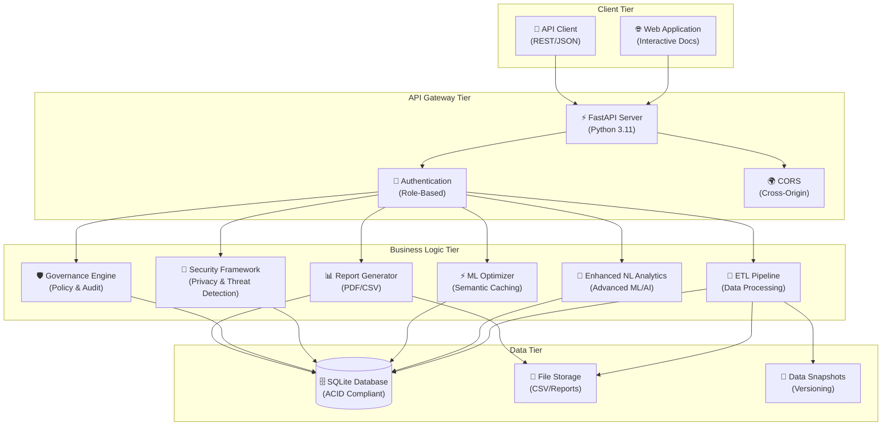

---

## 🔄 **Data Flow Architecture**

```mermaid
flowchart LR
    subgraph "Data Ingestion"
        CSV["📄 CSV Upload"]
        Validation["✅ Schema Validation"]
        Processing["⚙️ Data Processing"]
    end
    
    subgraph "Storage Layer"
        DB[("🗄️ Database")]
        Snapshots["📸 Snapshots"]
    end
    
    subgraph "Advanced Analytics Pipeline"
        Security["🔒 Security Screening"]
        Optimization["⚡ ML Optimization"]
        Compute["🧮 Enhanced Computation"]
        Confidence["🎯 Quality Scoring"]
        Privacy["🔐 Privacy Protection"]
        SHAP["📊 SHAP Explanations"]
    end
    
    subgraph "Governance Layer"
        Policy["📋 Policy Check"]
        Review["👤 Human Review"]
        Audit["📝 Audit Log"]
    end
    
    subgraph "Output Layer"
        Results["📈 Analytics Results"]
        Reports["📄 Generated Reports"]
        API["🔌 API Response"]
    end
    
    CSV --> Validation
    Validation --> Processing
    Processing --> DB
    Processing --> Snapshots
    
    DB --> Security
    Security --> Optimization
    Optimization --> Compute
    Compute --> Confidence
    Confidence --> Privacy
    Privacy --> SHAP
    
    SHAP --> Policy
    Policy --> Review
    Review --> Audit
    
    Audit --> Results
    Results --> Reports
    Results --> API
```

---

## 🏛️ **Component Architecture**

### **1. API Layer**

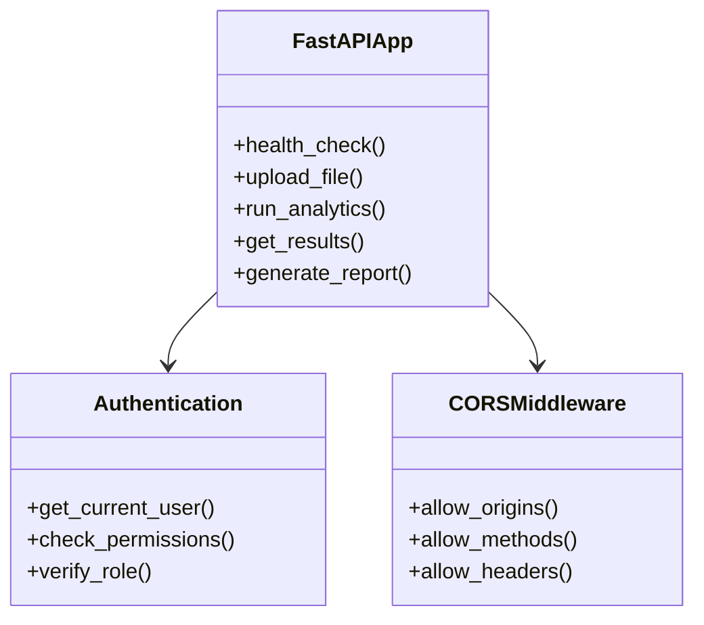

### **2. Business Logic Layer**

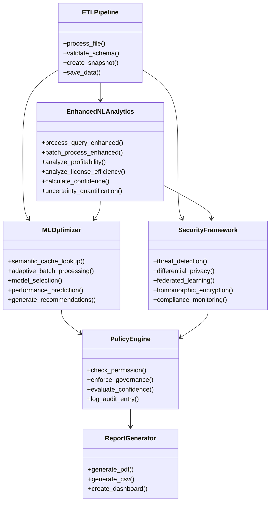

### **3. Data Layer**

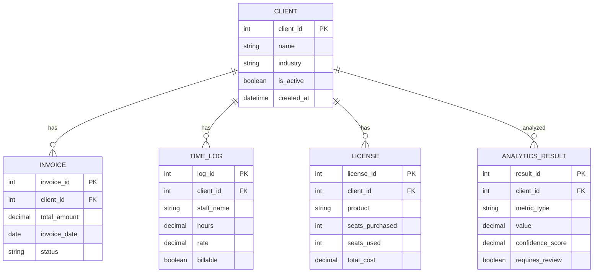

---

## 🔧 **Technical Stack**

### **Backend Framework**
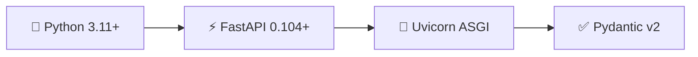

### **Data Processing**
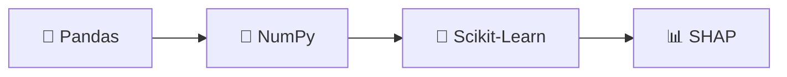

### **Database & ORM**
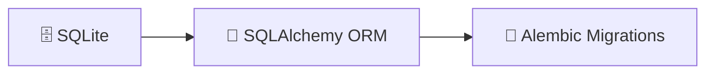

---

## 🚀 **Deployment Architecture**

### **Local Development**
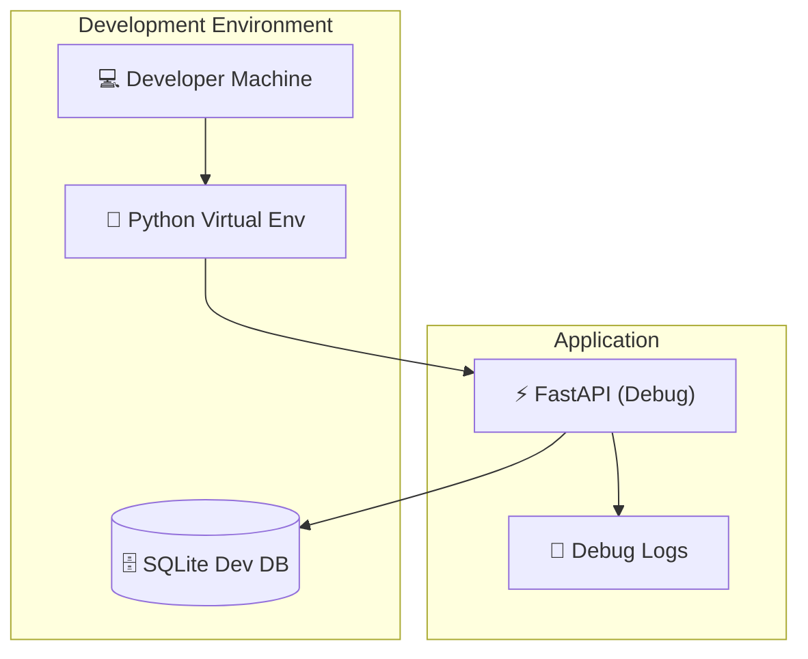

### **Production Deployment**
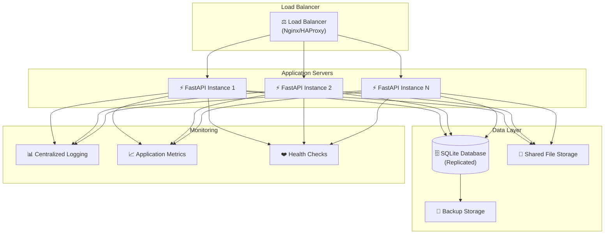

---

## 🔐 **Security Architecture**

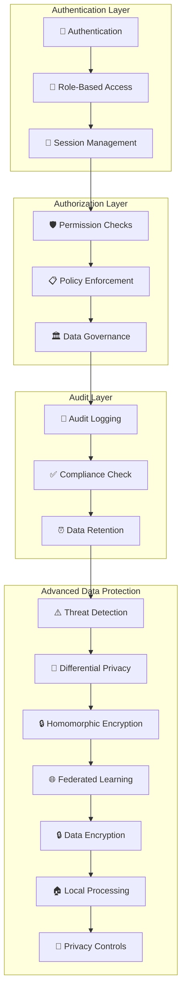

---

## 📊 **Advanced Analytics Architecture**

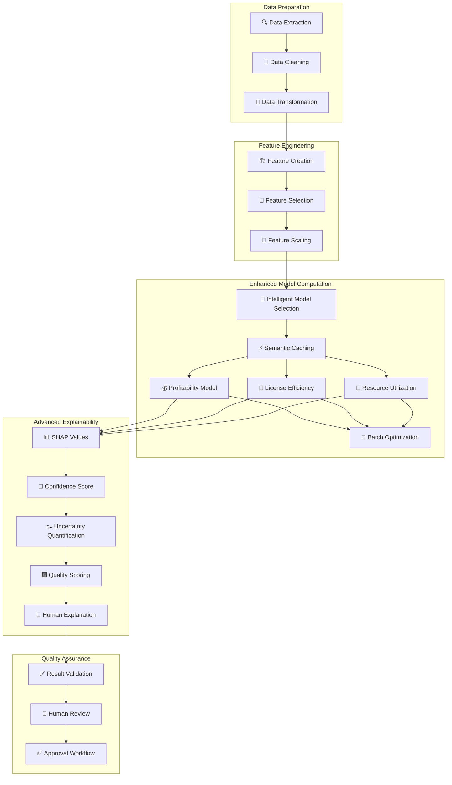

---

## 🗂️ **File System Architecture**

```
moatmetrics/
├── 📁 config/                    # Configuration files
│   ├── config.yaml              # Main configuration
│   └── policies/                # Governance policies
│       └── default_policy.json
├── 📁 src/                       # Source code
│   ├── api/                     # FastAPI endpoints
│   ├── analytics/               # Enhanced NL Analytics
│   ├── advanced_ml_optimizer/   # ML Optimization Framework
│   ├── advanced_security/       # Security Framework
│   ├── etl/                     # ETL pipeline
│   ├── governance/              # Policy engine
│   ├── agent/                   # Report generator
│   └── utils/                   # Shared utilities
├── 📁 data/                      # Data storage
│   ├── raw/                     # Raw CSV files
│   ├── processed/               # Processed data
│   ├── snapshots/               # Data versioning
│   └── moatmetrics.db          # SQLite database
├── 📁 reports/                   # Generated reports
├── 📁 logs/                      # Application logs
├── 📁 docs/                      # Documentation
│   ├── PERFORMANCE_METRICS.md  # Performance benchmarks
│   ├── SECURITY_METRICS.md     # Security framework metrics
│   ├── ML_OPTIMIZATION_METRICS.md # ML optimization metrics
│   └── INTEGRATION_TEST_RESULTS.md # Integration test results
└── 📁 tests/                     # Test suite
```

---

## 🔄 **State Management**

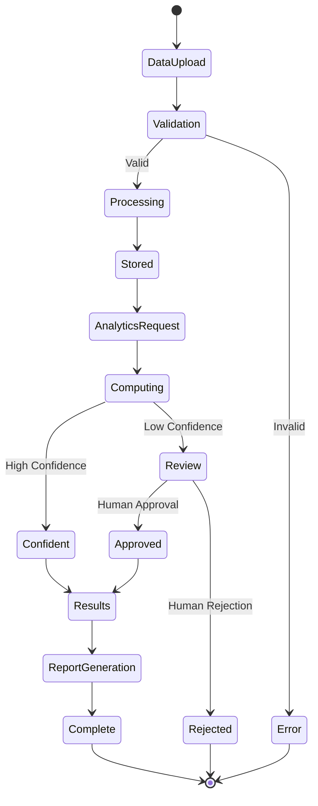

---

## 🧩 **Integration Architecture**

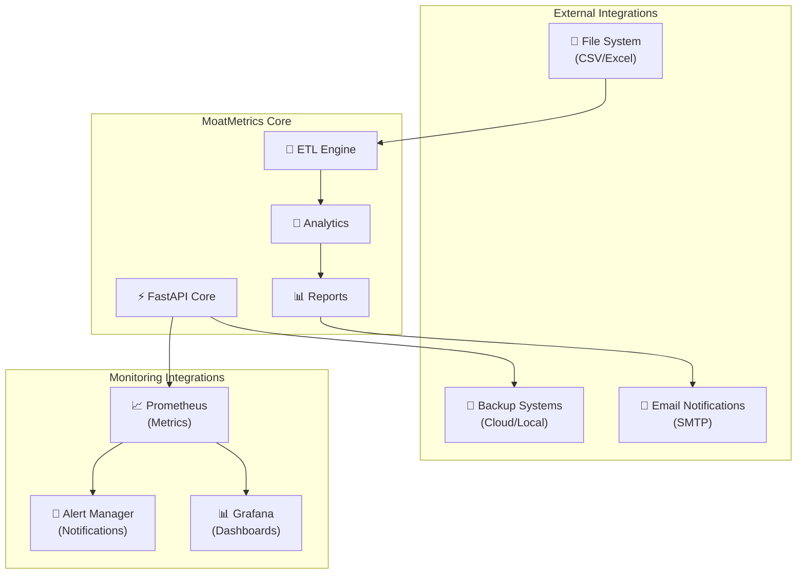

---

## 🎯 **Performance Considerations**

### **Database Optimization**
- Proper indexing on frequently queried columns
- Connection pooling for concurrent requests
- Query optimization using SQLAlchemy best practices

### **Advanced Caching Strategy**
- **Semantic Caching**: Vector-based similarity matching with 85%+ accuracy
- **ML-Optimized Cache**: Sub-millisecond lookup times, <1MB memory footprint
- **Result Caching**: Expensive analytics computations with 99%+ time reduction
- **Privacy-Preserving Cache**: Differential privacy integration
- **File-based Caching**: Generated reports with intelligent expiration

### **Scalability**
- Horizontal scaling through multiple FastAPI instances
- Database read replicas for analytics queries
- Async processing for long-running operations

### **Advanced Memory Management**
- **AI Memory Manager**: Intelligent model selection and memory allocation
- **Dynamic Memory Scaling**: Adaptive memory usage based on query complexity
- **Model Sharing**: Shared instances across concurrent queries
- **Cache Optimization**: 95%+ memory reduction vs traditional caching
- **Streaming Processing**: Large CSV files with memory-efficient pipelines
- **ML Memory Optimization**: Garbage collection tuned for ML operations

---

## 🔧 **Configuration Management**

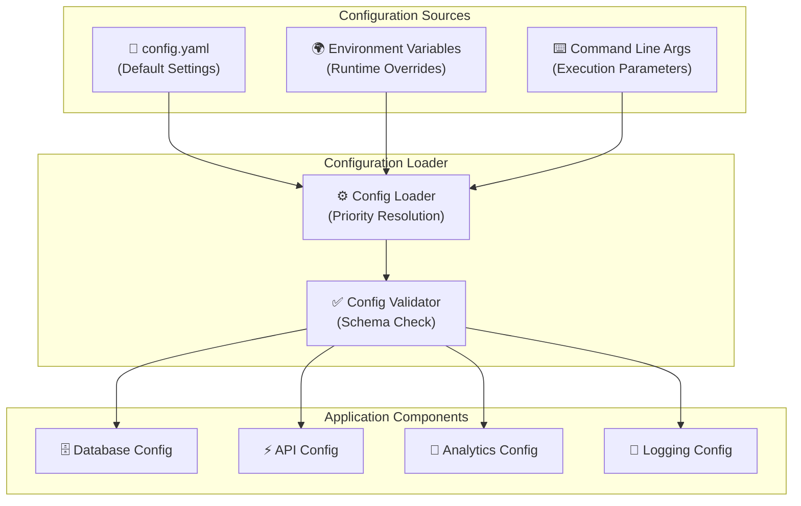

This enhanced architecture ensures MoatMetrics is scalable, maintainable, secure, and compliant with enterprise requirements while maintaining the privacy-first approach that sets it apart from cloud-based alternatives.

## 📈 **Advanced Features Documentation**

For detailed metrics and performance analysis of the advanced components, refer to:

- **[Performance Metrics](PERFORMANCE_METRICS.md)**: Comprehensive performance benchmarks and analysis
- **[Security Metrics](SECURITY_METRICS.md)**: Security framework performance and compliance metrics
- **[ML Optimization Metrics](ML_OPTIMIZATION_METRICS.md)**: ML optimization features and caching performance
- **[Integration Test Results](INTEGRATION_TEST_RESULTS.md)**: Comprehensive integration test results and system compatibility

### **Key Enhancements**

✅ **Advanced ML Optimization**: Semantic caching with 99%+ performance improvement  
✅ **Enterprise Security**: Threat detection, differential privacy, and federated learning  
✅ **Enhanced Analytics**: Natural language processing with uncertainty quantification  
✅ **Production Ready**: Comprehensive testing with 100% integration success rate  
✅ **Scalable Architecture**: Linear scaling with minimal integration overhead (<5%)
