# Project Roadmap

## 🗺️ **MoatMetrics Development & Business Roadmap**

Strategic roadmap for MoatMetrics product development, business growth, and market expansion from MVP to market leadership.

**Document Version**: 1.0.0  
**Last Updated**: September 4, 2025  
**Planning Horizon**: 2025-2027  
**Review Cycle**: Monthly

---

## 🎯 **Executive Summary**

### **Current Status**
- ✅ **MVP Complete**: All core features implemented and production-ready
- ✅ **Technical Debt**: Zero critical issues, comprehensive documentation
- ✅ **Go-to-Market Ready**: Product positioning and launch preparation complete
- 🎯 **Next Phase**: Beta customer acquisition and market validation

### **Strategic Objectives**
1. **Year 1 (2025-2026)**: Market validation and early customer acquisition (50+ customers, $1M ARR)
2. **Year 2 (2026-2027)**: Market expansion and feature enhancement (200+ customers, $5M ARR)
3. **Year 3 (2027-2028)**: Market leadership and platform evolution (500+ customers, $15M ARR)

---

## 📊 **Roadmap Overview**

### **Development Phases Timeline**


---

## ✅ **Phase 1: MVP Foundation (COMPLETED)**

### **Timeline**: August 15 - September 4, 2025 ✅

#### **Completed Deliverables**
- ✅ **Core Infrastructure**: FastAPI, SQLAlchemy, database models
- ✅ **Data Pipeline**: CSV upload, validation, storage
- ✅ **Analytics Engine**: Statistical calculations with confidence scoring
- ✅ **API Layer**: RESTful endpoints with OpenAPI documentation
- ✅ **Governance Framework**: Human-in-the-loop reviews and audit trails
- ✅ **Documentation Suite**: Complete guides for users and developers
- ✅ **Quality Assurance**: Bug fixes and production readiness

#### **Technical Achievements**
- **100% Feature Completeness**: All MVP requirements implemented
- **Zero Critical Bugs**: All major issues identified and resolved
- **Production Ready**: Deployment-ready with comprehensive documentation
- **Performance Optimized**: Sub-30-second analytics, efficient file processing

#### **Business Achievements**
- **Clear Value Proposition**: Privacy-first MSP analytics platform
- **Competitive Differentiation**: Explainable statistical analytics
- **Market Positioning**: Ready for beta customer acquisition
- **Technical Foundation**: Scalable architecture for future growth

---

## 🚀 **Phase 2: Market Validation & Early Growth**

### **Timeline**: September 15, 2025 - January 31, 2026

#### **2.1 Beta Program Launch (Sep 15 - Nov 15, 2025)**

**Objectives:**
- Recruit 10 strategic MSP beta customers
- Validate product-market fit
- Collect detailed user feedback
- Refine user experience and workflows

**Key Deliverables:**
- [ ] **Beta Customer Acquisition**: 10 qualified MSP partners
- [ ] **Customer Success Framework**: Onboarding, training, support processes
- [ ] **Feedback Collection System**: User interviews, surveys, usage analytics
- [ ] **Product Iteration**: Based on customer feedback and usage patterns

**Success Metrics:**
- **10 Beta Customers**: Successfully onboarded and actively using
- **NPS Score >50**: Customer satisfaction and product-market fit
- **80% Feature Adoption**: Users actively using core analytics features
- **<5% Monthly Churn**: Strong customer retention in beta

#### **2.2 Product Enhancement (Oct 1, 2025 - Jan 31, 2026)**

**Priority Features Based on Expected Feedback:**

##### **Enhanced Analytics**
- [ ] **Trend Analysis**: Historical pattern recognition and forecasting
- [ ] **Custom KPIs**: User-defined metrics and business rules
- [ ] **Benchmarking**: Industry comparison and competitive analysis
- [ ] **Advanced Filtering**: Enhanced data filtering and segmentation

##### **Improved User Experience**
- [ ] **Interactive Dashboards**: Web-based visualization interface
- [ ] **Report Templates**: Pre-built business report formats
- [ ] **Export Capabilities**: PDF, Excel, PowerPoint generation
- [ ] **Mobile Responsiveness**: Tablet and mobile device support

##### **Integration Foundations**
- [ ] **API Webhooks**: Real-time data synchronization
- [ ] **CSV Templates**: Downloadable data format templates
- [ ] **Bulk Operations**: Enhanced batch processing capabilities
- [ ] **Data Import Automation**: Scheduled data processing

**Technical Debt & Performance:**
- [ ] **Query Optimization**: Database performance improvements
- [ ] **Caching Layer**: Results caching for faster response times
- [ ] **Error Handling Enhancement**: More granular error reporting
- [ ] **Monitoring & Alerting**: Production monitoring dashboard

---

## 🏢 **Phase 3: Enterprise Features & Scale**

### **Timeline**: February 1, 2026 - July 31, 2026

#### **3.1 Advanced Analytics Platform (Feb 1 - Apr 30, 2026)**

**Machine Learning Integration:**
- [ ] **Predictive Analytics**: Client churn prediction models
- [ ] **Anomaly Detection**: Statistical outlier identification
- [ ] **Recommendation Engine**: AI-powered optimization suggestions
- [ ] **SHAP Integration**: Real explainable AI for feature importance

**Advanced Statistical Methods:**
- [ ] **Time Series Analysis**: Seasonal trend detection
- [ ] **Correlation Analysis**: Multi-dimensional relationship discovery
- [ ] **Risk Assessment**: Comprehensive client and project risk scoring
- [ ] **Scenario Planning**: What-if analysis and simulation tools

#### **3.2 Integration Ecosystem (Feb 1 - May 31, 2026)**

**PSA System Integrations:**
- [ ] **ConnectWise Manage**: Native API integration
- [ ] **Autotask**: Datto PSA connectivity
- [ ] **ServiceNow**: Enterprise PSA integration
- [ ] **Generic PSA**: Configurable integration framework

**RMM & Tool Integrations:**
- [ ] **Kaseya**: RMM data synchronization
- [ ] **Datto RMM**: Monitoring and asset data
- [ ] **SolarWinds MSP**: Comprehensive tool integration
- [ ] **Microsoft 365**: License usage analytics

**Financial System Integrations:**
- [ ] **QuickBooks**: Accounting and financial data
- [ ] **Xero**: Alternative accounting platform
- [ ] **FreshBooks**: Small business accounting
- [ ] **Generic Accounting**: Configurable integration

#### **3.3 Enterprise Features (Apr 1 - Jul 31, 2026)**

**Multi-Tenancy & Organization Management:**
- [ ] **Organization Hierarchy**: Support for multiple MSPs
- [ ] **Data Isolation**: Tenant-specific data separation
- [ ] **Custom Branding**: White-label capabilities
- [ ] **Centralized Management**: Multi-location support

**Advanced Security & Compliance:**
- [ ] **SSO Integration**: SAML, OAuth2, Azure AD, Okta
- [ ] **Advanced RBAC**: Fine-grained permissions and policies
- [ ] **Data Encryption**: End-to-end encryption for sensitive data
- [ ] **Compliance Automation**: GDPR, HIPAA, SOC2 dashboards

**Performance & Scalability:**
- [ ] **Microservices Architecture**: Service decomposition
- [ ] **Container Orchestration**: Kubernetes deployment
- [ ] **Database Scaling**: PostgreSQL clustering and read replicas
- [ ] **Global CDN**: Multi-region content delivery

---

## 🤖 **Phase 4: AI/ML Innovation & Market Leadership**

### **Timeline**: June 1, 2026 - December 31, 2026

#### **4.1 Advanced AI Capabilities (Jun 1 - Oct 31, 2026)**

**Natural Language Processing:**
- [ ] **Chat Interface**: Natural language analytics queries
- [ ] **Document Processing**: Automated invoice and contract analysis
- [ ] **Report Generation**: AI-powered business report creation
- [ ] **Insight Summarization**: Automated executive summaries

**Machine Learning Platform:**
- [ ] **AutoML Framework**: Self-improving predictive models
- [ ] **Model Management**: MLOps pipeline for model lifecycle
- [ ] **A/B Testing**: ML model performance comparison
- [ ] **Continuous Learning**: Models that improve with more data

**Advanced Analytics:**
- [ ] **Deep Learning Models**: Pattern recognition for complex relationships
- [ ] **Ensemble Methods**: Multiple model combination for accuracy
- [ ] **Real-time Analytics**: Stream processing for live insights
- [ ] **Predictive Maintenance**: Proactive issue identification

#### **4.2 Platform Innovation (Aug 1 - Dec 31, 2026)**

**Intelligent Automation:**
- [ ] **Workflow Automation**: AI-driven process optimization
- [ ] **Smart Notifications**: Context-aware alerting system
- [ ] **Predictive Scheduling**: Resource allocation optimization
- [ ] **Automated Reporting**: Self-generating business reports

**Advanced Visualization:**
- [ ] **Interactive Analytics**: Drag-and-drop analysis interface
- [ ] **3D Data Visualization**: Complex relationship mapping
- [ ] **Real-time Dashboards**: Live updating business metrics
- [ ] **Mobile Analytics**: Full-featured mobile application

---

## 💼 **Business Roadmap**

### **Go-to-Market Timeline**

#### **Phase 2A: Beta Launch (Oct 1 - Dec 31, 2025)**

**Marketing & Sales:**
- [ ] **Beta Program Announcement**: MSP community outreach
- [ ] **Industry Conference Presence**: MSP conferences and events
- [ ] **Content Marketing**: Blog, whitepapers, case studies
- [ ] **Partner Channel Development**: PSA/RMM vendor relationships

**Customer Acquisition:**
- [ ] **Direct Sales Team**: Hire 1-2 MSP-focused sales professionals
- [ ] **Customer Success Team**: Onboarding and support specialists
- [ ] **Referral Program**: Customer-driven growth incentives
- [ ] **Free Trial Program**: 30-day full-feature trial

**Metrics & Goals:**
- **10 Beta Customers**: Strategic MSP partners
- **Product-Market Fit**: NPS >50, customer retention >90%
- **Monthly Usage**: 70%+ Monthly Active Users
- **Initial Revenue**: $50K ARR from beta customers

#### **Phase 2B: Limited Release (Jan 1 - Jun 30, 2026)**

**Market Expansion:**
- [ ] **General Availability Launch**: Public product launch
- [ ] **Pricing Strategy Execution**: Freemium to enterprise tiers
- [ ] **Customer Acquisition Scale**: Target 50 paying customers
- [ ] **International Expansion**: English-speaking markets

**Business Development:**
- [ ] **Strategic Partnerships**: PSA/RMM integration partnerships
- [ ] **Reseller Network**: MSP consultant and advisor partnerships
- [ ] **Industry Recognition**: Awards, analyst reports, media coverage
- [ ] **Funding Strategy**: Series A preparation and execution

**Metrics & Goals:**
- **50 Paying Customers**: Diverse customer base
- **$500K ARR**: Sustainable revenue growth
- **<10% Monthly Churn**: Strong product-market fit
- **Market Recognition**: Top 10 MSP tool mentions

### **Revenue Model Evolution**

#### **Year 1 (2025-2026): Foundation**
```
Freemium Model:
├── Free Tier (5 clients max)
├── Professional ($99/month) - Target: 40 customers
├── Enterprise ($299/month) - Target: 10 customers
└── Custom Pricing - Target: 5 customers

Revenue Target: $1M ARR
Customer Target: 50+ paying customers
```

#### **Year 2 (2026-2027): Growth**
```
Enhanced Tiers:
├── Starter ($49/month) - Target: 100 customers
├── Professional ($149/month) - Target: 80 customers  
├── Enterprise ($399/month) - Target: 30 customers
└── Platform ($999/month) - Target: 10 customers

Revenue Target: $5M ARR
Customer Target: 200+ paying customers
```

#### **Year 3 (2027-2028): Leadership**
```
Platform Model:
├── Core Platform ($99/month) - Target: 300 customers
├── Advanced Analytics ($249/month) - Target: 150 customers
├── Enterprise Suite ($599/month) - Target: 50 customers
└── White-label Platform ($1999/month) - Target: 20 customers

Revenue Target: $15M ARR
Customer Target: 500+ paying customers
```

---

## 🎯 **Feature Roadmap by Priority**

### **High Priority Features (Q4 2025 - Q1 2026)**

#### **P0: Critical for Customer Success**
1. **Enhanced Data Validation** (Q4 2025)
   - Advanced schema validation
   - Data quality recommendations
   - Automatic data cleaning suggestions
   - Client name matching algorithms

2. **Report Generation** (Q4 2025)
   - PDF executive summaries
   - Excel detailed reports
   - PowerPoint presentation templates
   - Customizable report branding

3. **Performance Optimization** (Q1 2026)
   - Query performance improvements
   - Large dataset handling (100K+ records)
   - Memory usage optimization
   - Response time improvements

#### **P1: Important for Growth**
1. **Interactive Dashboards** (Q1 2026)
   - Web-based visualization
   - Real-time data updates
   - Drill-down capabilities
   - Custom dashboard creation

2. **API Enhancements** (Q1 2026)
   - Webhook support for real-time sync
   - Batch operation endpoints
   - Advanced filtering and search
   - Rate limiting improvements

3. **User Management** (Q1 2026)
   - Multiple user accounts
   - Role-based dashboard customization
   - User activity tracking
   - Team collaboration features

### **Medium Priority Features (Q2 2026 - Q3 2026)**

#### **P2: Competitive Differentiation**
1. **PSA Integration** (Q2 2026)
   - ConnectWise Manage connector
   - Autotask API integration
   - Real-time data synchronization
   - Bi-directional data flow

2. **Advanced Analytics** (Q2 2026)
   - Predictive client churn models
   - Revenue forecasting
   - Capacity planning algorithms
   - Trend analysis and seasonality

3. **Mobile Application** (Q3 2026)
   - iOS and Android apps
   - Key metrics dashboard
   - Push notifications for insights
   - Offline report access

#### **P3: Enterprise Requirements**
1. **Multi-Tenant Architecture** (Q2 2026)
   - Organization management
   - Data isolation and security
   - Centralized administration
   - White-label capabilities

2. **Advanced Security** (Q3 2026)
   - SSO integration (SAML, OAuth2)
   - Advanced audit trails
   - Data encryption at rest
   - Compliance automation

3. **High Availability** (Q3 2026)
   - Load balancing
   - Database clustering
   - Automated failover
   - Disaster recovery

### **Future Innovation Features (Q4 2026+)**

#### **P4: Next-Generation Platform**
1. **AI-Powered Analytics** (Q4 2026)
   - Real SHAP explainability
   - Deep learning models
   - Natural language insights
   - Automated business recommendations

2. **Intelligent Automation** (Q1 2027)
   - Workflow automation
   - Smart scheduling
   - Proactive monitoring
   - Self-optimizing systems

3. **Advanced Integrations** (Q1 2027)
   - Microsoft ecosystem integration
   - Salesforce CRM connectivity
   - Financial planning tools
   - Business intelligence platforms

---

## 🎯 **Success Metrics by Phase**

### **Phase 2 Success Criteria (Q4 2025 - Q1 2026)**

#### **Customer Metrics**
- **Beta Customers**: 10 strategic MSP partners
- **Customer Satisfaction**: NPS score >50
- **Product-Market Fit**: 80%+ feature adoption
- **Customer Retention**: >90% beta customer retention

#### **Product Metrics**
- **System Reliability**: 99.5% uptime
- **Performance**: <30s analytics, <2s API responses
- **Data Quality**: 95%+ successful uploads
- **User Engagement**: 70%+ Monthly Active Users

#### **Business Metrics**
- **Revenue**: $100K ARR from beta customers
- **Feedback Quality**: Detailed insights from 80%+ customers
- **Market Validation**: Positive analyst and media coverage
- **Team Growth**: 3-5 additional team members

### **Phase 3 Success Criteria (Q2 2026 - Q3 2026)**

#### **Scale Metrics**
- **Customer Base**: 50-100 paying customers
- **Revenue Growth**: $500K - $1M ARR
- **Market Presence**: Top 10 MSP analytics platform recognition
- **International Reach**: Customers in 3+ countries

#### **Product Metrics**
- **Enterprise Readiness**: Multi-tenant, SSO, advanced security
- **Integration Ecosystem**: 3+ PSA/RMM integrations
- **Platform Stability**: 99.9% uptime, <1% error rate
- **Advanced Analytics**: Predictive models in production

#### **Competitive Position**
- **Feature Parity**: Competitive with established players
- **Differentiation**: Unique privacy-first positioning
- **Customer Advocacy**: 5+ detailed case studies
- **Industry Recognition**: Conference speaking, awards

### **Phase 4 Success Criteria (Q4 2026+)**

#### **Market Leadership**
- **Customer Base**: 200+ paying customers
- **Revenue Scale**: $5M+ ARR
- **Market Share**: Top 3 MSP analytics platform
- **Global Presence**: Customers in 10+ countries

#### **Innovation Leadership**
- **AI Capabilities**: Production ML models with SHAP
- **Technology Leadership**: Open-source contributions
- **Thought Leadership**: Industry research and publications
- **Partner Ecosystem**: 10+ strategic partnerships

---

## 🛠️ **Technical Roadmap**

### **Architecture Evolution**

#### **Phase 2: Monolithic Optimization**
```
Current: Single Application
├── FastAPI Monolith
├── SQLite/PostgreSQL
├── File-based Configuration
└── Local Analytics Processing

Enhancements:
├── Query Optimization
├── Connection Pooling
├── Result Caching
└── Error Handling Improvements
```

#### **Phase 3: Modular Platform**
```
Target: Modular Architecture
├── API Gateway (Kong/Ambassador)
├── Analytics Service (Independent)
├── Data Processing Service
├── Notification Service
├── Integration Service
└── Shared Database Cluster
```

#### **Phase 4: Microservices Platform**
```
Future: Cloud-Native Microservices
├── Service Mesh (Istio)
├── Event-Driven Architecture
├── Container Orchestration (Kubernetes)
├── Distributed Analytics
├── ML Model Serving
└── Multi-Region Deployment
```

### **Technology Evolution**

#### **Data Processing Enhancement**
- **Current**: Pandas, NumPy for statistical calculations
- **Phase 3**: Apache Spark for big data processing
- **Phase 4**: Real-time stream processing with Apache Kafka

#### **Analytics Evolution**
- **Current**: Rule-based statistical analytics
- **Phase 3**: Scikit-learn ML models with cross-validation
- **Phase 4**: TensorFlow/PyTorch deep learning models

#### **Database Evolution**
- **Current**: SQLite (dev), PostgreSQL (prod)
- **Phase 3**: PostgreSQL with read replicas and sharding
- **Phase 4**: Multi-region distributed database (CockroachDB)

#### **Infrastructure Evolution**
- **Current**: Single-server deployment
- **Phase 3**: Kubernetes cluster with auto-scaling
- **Phase 4**: Multi-cloud deployment with edge processing

---

## 💰 **Investment & Resource Planning**

### **Funding Requirements**

#### **Phase 2 (Beta & Early Growth): $500K**
- **Team Expansion**: $300K (3-4 additional team members)
- **Sales & Marketing**: $100K (beta program, conferences)
- **Infrastructure**: $50K (cloud hosting, tools, security)
- **Operations**: $50K (legal, accounting, miscellaneous)

#### **Phase 3 (Scale & Enterprise): $2M**
- **Team Expansion**: $1.2M (8-10 additional team members)
- **Sales & Marketing**: $500K (enterprise sales, marketing)
- **Infrastructure**: $200K (enterprise-grade hosting, security)
- **R&D**: $100K (advanced features, integrations)

#### **Phase 4 (AI/ML & Leadership): $5M**
- **Team Expansion**: $3M (15-20 additional team members)
- **AI/ML Research**: $1M (data scientists, ML engineers)
- **Global Expansion**: $500K (international sales, localization)
- **Infrastructure**: $500K (global deployment, enterprise tools)

### **Team Growth Plan**

#### **Phase 2 Team (5-8 people)**
- **Engineering**: 2-3 full-stack developers
- **Sales**: 1 enterprise sales professional
- **Customer Success**: 1 customer success manager
- **Product**: 1 product manager (part-time consultant)

#### **Phase 3 Team (12-15 people)**
- **Engineering**: 5-6 developers (backend, frontend, DevOps)
- **Data Science**: 1-2 data scientists and ML engineers
- **Sales & Marketing**: 3-4 sales and marketing professionals
- **Operations**: 2-3 customer success and support staff
- **Leadership**: 1 VP of Engineering or CTO

#### **Phase 4 Team (25-30 people)**
- **Engineering**: 10-12 developers across multiple teams
- **Data Science**: 4-5 ML engineers and data scientists
- **Sales & Marketing**: 6-8 sales, marketing, and partnership professionals
- **Operations**: 4-5 customer success, support, and operations staff
- **Leadership**: C-level executives and senior management

---

## 🔍 **Risk Management**

### **Technical Risks & Mitigation**

#### **Scalability Challenges**
- **Risk**: Performance degradation with large customer base
- **Mitigation**: Microservices architecture, cloud-native design
- **Timeline**: Address by Phase 3
- **Investment**: $200K in infrastructure and architecture

#### **Technology Obsolescence**
- **Risk**: Core technologies becoming outdated
- **Mitigation**: Modular architecture, regular technology review
- **Timeline**: Ongoing technology assessment
- **Investment**: 10% of engineering budget for technology refresh

#### **Security Vulnerabilities**
- **Risk**: Data breaches or security incidents
- **Mitigation**: Security-first development, regular audits
- **Timeline**: Continuous security improvement
- **Investment**: $100K annual security budget

### **Business Risks & Mitigation**

#### **Competitive Response**
- **Risk**: Large vendors copying features
- **Mitigation**: Continuous innovation, patent protection
- **Timeline**: Ongoing competitive analysis
- **Strategy**: Focus on privacy and MSP-specific features

#### **Market Adoption**
- **Risk**: Slower than expected customer acquisition
- **Mitigation**: Strong value proposition, customer success focus
- **Timeline**: Monitor quarterly, adjust strategy as needed
- **Contingency**: Extended runway, pivot to adjacent markets

#### **Economic Downturn**
- **Risk**: Reduced MSP spending on analytics tools
- **Mitigation**: ROI-focused positioning, flexible pricing
- **Timeline**: Monitor economic indicators
- **Strategy**: Emphasize cost savings and efficiency

---

## 📈 **Key Performance Indicators (KPIs)**

### **Product Development KPIs**

| **Phase** | **Metric** | **Q4 2025** | **Q2 2026** | **Q4 2026** |
|---|---|---|---|---|
| **Features** | Completed Features | 15 | 35 | 60 |
| **Quality** | Bug Escape Rate | <5% | <3% | <1% |
| **Performance** | API Response Time | <200ms | <150ms | <100ms |
| **Reliability** | System Uptime | 99.5% | 99.9% | 99.95% |

### **Customer Success KPIs**

| **Phase** | **Metric** | **Q4 2025** | **Q2 2026** | **Q4 2026** |
|---|---|---|---|---|
| **Growth** | Total Customers | 10 | 50 | 150 |
| **Satisfaction** | NPS Score | >50 | >60 | >70 |
| **Retention** | Monthly Churn | <5% | <3% | <2% |
| **Usage** | Monthly Active Users | 70% | 80% | 85% |

### **Business Growth KPIs**

| **Phase** | **Metric** | **Q4 2025** | **Q2 2026** | **Q4 2026** |
|---|---|---|---|---|
| **Revenue** | Annual Recurring Revenue | $100K | $1M | $5M |
| **Efficiency** | Customer Acquisition Cost | <$1K | <$1.5K | <$2K |
| **Value** | Customer Lifetime Value | >$5K | >$10K | >$20K |
| **Growth** | Month-over-Month Growth | 15% | 10% | 8% |

---

## 🚦 **Milestone Dependencies**

### **Critical Path Analysis**

```mermaid
flowchart LR
    MVP[MVP Complete ✅] --> Beta[Beta Program]
    Beta --> Feedback[Customer Feedback]
    Feedback --> Features[Feature Enhancement]
    Features --> Scale[Scale Preparation]
    Scale --> Enterprise[Enterprise Features]
    Enterprise --> AI[AI/ML Integration]
    AI --> Leadership[Market Leadership]
```



### **Dependency Management**

#### **Technical Dependencies**
1. **Database Performance**: Must scale before 10K+ records per customer
2. **API Stability**: Required before enterprise customer acquisition  
3. **Security Framework**: Prerequisite for enterprise sales
4. **Integration Platform**: Needed for PSA/RMM partnerships

#### **Business Dependencies**
1. **Product-Market Fit**: Required before major marketing investment
2. **Customer Success Framework**: Prerequisite for scaling customers
3. **Sales Process**: Needed before enterprise customer targeting
4. **Partner Relationships**: Required for integration development

#### **Resource Dependencies**
1. **Engineering Team**: Must scale before advanced feature development
2. **Data Science Team**: Required for ML model development
3. **Sales Team**: Needed for enterprise customer acquisition
4. **Infrastructure Investment**: Required for scaling beyond 50 customers

---

## 🔄 **Roadmap Monitoring & Updates**

### **Review Schedule**
- **Monthly**: Progress review against milestones
- **Quarterly**: Strategic direction and priority adjustment
- **Semi-Annual**: Market analysis and competitive assessment
- **Annual**: Comprehensive roadmap revision

### **Decision Framework**

#### **Feature Prioritization Matrix**
```
High Impact, Low Effort → Immediate (P0)
High Impact, High Effort → Plan & Resource (P1)
Low Impact, Low Effort → Consider (P2)
Low Impact, High Effort → Defer (P3)
```

#### **Go/No-Go Criteria for Phase Advancement**
1. **Technical Readiness**: All P0 features completed and stable
2. **Market Validation**: Customer success metrics achieved
3. **Resource Availability**: Team and funding in place
4. **Competitive Position**: Maintaining differentiation

### **Roadmap Flexibility**
- **Monthly Adjustments**: Feature priority based on customer feedback
- **Quarterly Pivots**: Strategic direction based on market response
- **Annual Reviews**: Long-term vision and roadmap updates

---

## 📞 **Stakeholder Communication**

### **Roadmap Stakeholders**

#### **Internal Stakeholders**
- **Engineering Team**: Technical feasibility and timeline accuracy
- **Product Management**: Feature prioritization and customer requirements
- **Sales Team**: Market requirements and competitive positioning
- **Executive Team**: Strategic direction and resource allocation

#### **External Stakeholders**
- **Beta Customers**: Feature requests and feedback incorporation
- **Strategic Partners**: Integration roadmap alignment
- **Investors**: Progress updates and milestone achievement
- **Industry Analysts**: Market positioning and competitive analysis

### **Communication Channels**
- **Monthly Updates**: All-hands meetings with roadmap progress
- **Quarterly Reviews**: Board meetings with strategic assessment
- **Customer Advisory Board**: Quarterly input on product direction
- **Public Roadmap**: High-level feature timeline for customers

---

**This roadmap provides strategic guidance for MoatMetrics evolution from MVP to market-leading platform, with clear milestones, success metrics, and resource requirements for each phase.** 🚀

---

**Document Status**: Strategic Planning Document  
**Next Review**: October 1, 2025  
**Owner**: Product Management  
**Approved By**: Executive Team
