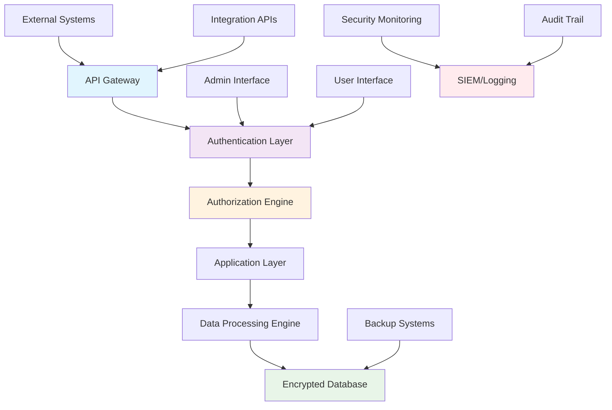

# Security Framework

## 📋 **Document Overview**

**Document Type**: Security Framework  
**Version**: 1.0.0  
**Owner**: Security Team  
**Last Updated**: September 4, 2025  
**Review Cycle**: Quarterly  
**Classification**: Confidential  
**Status**: Approved

**Audience**: Security Team, Engineering, Compliance, Executive Leadership

---

## 🎯 **Executive Summary**

MoatMetrics implements a comprehensive security framework designed specifically for MSP environments handling sensitive client data. Our "privacy-first" architecture ensures all analytics processing occurs locally, eliminating cloud data exposure risks while maintaining enterprise-grade security controls.

### **Core Security Principles**
- **Zero Trust Architecture**: Never trust, always verify
- **Privacy by Design**: Local processing, no external data sharing
- **Defense in Depth**: Multiple layered security controls
- **Compliance First**: Built for GDPR, HIPAA, SOX requirements
- **Continuous Monitoring**: Real-time threat detection and response

### **Key Security Features**
- **Local Data Processing**: All analytics run on-premises
- **End-to-End Encryption**: AES-256 encryption at rest and TLS 1.3 in transit
- **Role-Based Access Control**: Granular permission system
- **Audit Trail**: Comprehensive activity logging
- **Vulnerability Management**: Automated security scanning and updates

---

## 🏗️ **Security Architecture**

### **Architectural Overview**



### **Security Zones & Network Segmentation**

#### **Zone 1: DMZ (Demilitarized Zone)**
- **Components**: API Gateway, Load Balancer, WAF
- **Access**: Internet-facing, filtered traffic only
- **Security**: DDoS protection, rate limiting, IP filtering

#### **Zone 2: Application Layer**
- **Components**: Web application, API services, authentication
- **Access**: Internal network only
- **Security**: Application firewall, input validation, session management

#### **Zone 3: Data Layer**
- **Components**: Database servers, file storage, backup systems
- **Access**: Application layer only
- **Security**: Database firewall, encryption, access logging

#### **Zone 4: Management Network**
- **Components**: Admin interfaces, monitoring, logging
- **Access**: Administrative staff only
- **Security**: VPN required, MFA enforced, privileged access management

---

## 🔐 **Authentication & Authorization**

### **Multi-Factor Authentication (MFA)**

#### **Supported MFA Methods**
1. **TOTP (Time-based One-Time Password)**
   - Google Authenticator, Authy, Microsoft Authenticator
   - 6-digit codes, 30-second rotation
   - Backup codes provided

2. **Hardware Security Keys**
   - FIDO2/WebAuthn compatible (YubiKey, etc.)
   - Phishing-resistant authentication
   - USB, NFC, and Bluetooth support

3. **SMS/Email Backup** (Emergency Only)
   - Used only when primary methods unavailable
   - Limited to account recovery scenarios
   - Rate limited and monitored

#### **MFA Enforcement Policies**

```yaml
# MFA enforcement rules
mfa_policies:
  admin_users:
    enforce: true
    methods_required: 2  # Primary + backup method
    grace_period: 0      # No grace period
    
  regular_users:
    enforce: true
    methods_required: 1
    grace_period: "7 days"  # For new users
    
  api_access:
    enforce: true
    methods_required: 1
    certificate_based: preferred
```

### **Role-Based Access Control (RBAC)**

#### **Standard Roles**

```python path=null start=null
# MoatMetrics role definitions
ROLES = {
    'system_admin': {
        'description': 'Full system access and configuration',
        'permissions': [
            'system.admin',
            'user.manage',
            'integration.manage',
            'security.configure',
            'audit.full_access'
        ],
        'restrictions': ['requires_mfa', 'session_timeout_30min']
    },
    
    'msp_admin': {
        'description': 'MSP organization administrator',
        'permissions': [
            'org.admin',
            'user.create',
            'client.manage',
            'analytics.full_access',
            'report.create'
        ],
        'restrictions': ['requires_mfa', 'ip_whitelist']
    },
    
    'analyst': {
        'description': 'Financial and operational analyst',
        'permissions': [
            'analytics.read',
            'report.create',
            'client.read',
            'dashboard.configure'
        ],
        'restrictions': ['data_export_limited']
    },
    
    'viewer': {
        'description': 'Read-only access to dashboards',
        'permissions': [
            'dashboard.read',
            'report.read'
        ],
        'restrictions': ['no_data_export']
    }
}\n```

#### **Permission Matrix**

| **Resource** | **System Admin** | **MSP Admin** | **Analyst** | **Viewer** |
|---|---|---|---|---|
| **User Management** | ✅ Full | ✅ Org Only | ❌ None | ❌ None |
| **Client Data** | ✅ Full | ✅ Full | 📖 Read Only | 📖 Limited |
| **Financial Data** | ✅ Full | ✅ Full | ✅ Full | 📖 Summarized |
| **System Config** | ✅ Full | 🔶 Limited | ❌ None | ❌ None |
| **Integrations** | ✅ Full | ✅ Full | 📖 Status Only | ❌ None |
| **Audit Logs** | ✅ Full | 📖 Org Only | ❌ None | ❌ None |
| **Data Export** | ✅ Full | ✅ Full | 🔶 Limited | ❌ None |

### **Single Sign-On (SSO) Integration**

#### **Supported SSO Providers**
- **Microsoft Azure AD/Entra ID**: SAML 2.0, OpenID Connect
- **Google Workspace**: OpenID Connect, OAuth 2.0
- **Okta**: SAML 2.0, OpenID Connect
- **ADFS**: SAML 2.0
- **Generic SAML**: Any SAML 2.0 compliant provider

#### **SSO Configuration Example**

```xml
<!-- SAML 2.0 configuration for Azure AD -->
<saml:Issuer>
    https://sts.windows.net/{tenant-id}/
</saml:Issuer>
<saml:NameIDPolicy 
    Format="urn:oasis:names:tc:SAML:2.0:nameid-format:persistent"
    AllowCreate="true"/>
<saml:AuthnContext>
    <saml:AuthnContextClassRef>
        urn:oasis:names:tc:SAML:2.0:ac:classes:PasswordProtectedTransport
    </saml:AuthnContextClassRef>
</saml:AuthnContext>
```

---

## 🔒 **Data Protection**

### **Encryption Strategy**

#### **Encryption at Rest**
- **Algorithm**: AES-256-GCM
- **Key Management**: HSM-backed key storage
- **Database**: Transparent Data Encryption (TDE)
- **Files**: Full disk encryption (LUKS/BitLocker)
- **Backups**: Encrypted before storage

#### **Encryption in Transit**
- **Protocol**: TLS 1.3 minimum
- **Cipher Suites**: Perfect Forward Secrecy (PFS) required
- **Certificate Management**: Automated renewal with Let's Encrypt
- **API Communications**: mTLS for service-to-service

#### **Key Management**

```python path=null start=null
# Key management configuration
encryption_config = {
    'master_key': {
        'algorithm': 'AES-256',
        'rotation_period': '90 days',
        'storage': 'hsm',
        'backup': 'encrypted_multiple_locations'
    },
    'data_keys': {
        'derivation': 'PBKDF2',
        'salt_length': 32,
        'iterations': 100000
    },
    'certificate_management': {
        'auto_renewal': True,
        'validity_period': '90 days',
        'key_algorithm': 'RSA-4096'
    }
}
```

### **Data Classification & Handling**

#### **Data Classification Levels**

| **Level** | **Description** | **Examples** | **Security Controls** |
|---|---|---|---|
| **Public** | Non-sensitive information | Product documentation, marketing | Standard access controls |
| **Internal** | Business information | Analytics dashboards, reports | Authentication required |
| **Confidential** | Sensitive business data | Client contracts, financial data | Role-based access, encryption |
| **Restricted** | Highly sensitive data | PII, payment info, credentials | Enhanced controls, audit logging |

#### **Data Handling Policies**

```python path=null start=null
# Data handling configuration
data_handling = {
    'classification_rules': {
        'client_financial_data': 'confidential',
        'user_credentials': 'restricted',
        'analytics_results': 'internal',
        'system_logs': 'internal'
    },
    'access_controls': {
        'confidential': ['authentication', 'authorization', 'encryption'],
        'restricted': ['mfa', 'audit_logging', 'data_masking', 'encryption']
    },
    'retention_periods': {
        'analytics_data': '7 years',
        'audit_logs': '7 years',
        'session_logs': '90 days',
        'temporary_files': '24 hours'
    }
}
```

### **Privacy Protection**

#### **Privacy by Design Implementation**
1. **Data Minimization**: Collect only necessary data
2. **Purpose Limitation**: Use data only for stated purposes
3. **Local Processing**: No external data sharing
4. **User Control**: Data export and deletion capabilities
5. **Transparency**: Clear data processing documentation

#### **Personal Data Protection**

```python path=null start=null
# Personal data protection measures
privacy_controls = {
    'data_anonymization': {
        'method': 'k_anonymity',
        'k_value': 5,
        'quasi_identifiers': ['job_title', 'department', 'location']
    },
    'data_pseudonymization': {
        'algorithm': 'HMAC_SHA256',
        'key_rotation': '30 days',
        'reversible': False
    },
    'consent_management': {
        'granular_consent': True,
        'consent_withdrawal': True,
        'consent_audit_trail': True
    }
}
```

---

## 🛡️ **Network Security**

### **Firewall Configuration**

#### **Inbound Rules**
```bash path=null start=null
# Firewall rules for MoatMetrics
# HTTPS traffic (443)
iptables -A INPUT -p tcp --dport 443 -s 0.0.0.0/0 -j ACCEPT

# SSH access (22) - restricted IPs
iptables -A INPUT -p tcp --dport 22 -s 192.168.1.0/24 -j ACCEPT

# Database (5432) - application servers only  
iptables -A INPUT -p tcp --dport 5432 -s 10.0.1.0/24 -j ACCEPT

# Default deny
iptables -P INPUT DROP
```

#### **Outbound Rules**
```bash path=null start=null
# Outbound firewall rules
# HTTPS for API integrations
iptables -A OUTPUT -p tcp --dport 443 -j ACCEPT

# DNS resolution
iptables -A OUTPUT -p udp --dport 53 -j ACCEPT

# NTP synchronization
iptables -A OUTPUT -p udp --dport 123 -j ACCEPT

# Default deny
iptables -P OUTPUT DROP
```

### **Web Application Firewall (WAF)**

#### **WAF Rules Configuration**

```yaml
# WAF security rules
waf_rules:
  rate_limiting:
    requests_per_minute: 1000
    burst_capacity: 100
    block_duration: "15 minutes"
    
  sql_injection:
    enable: true
    block_mode: true
    log_attempts: true
    
  xss_protection:
    enable: true
    content_type_validation: true
    script_tag_filtering: true
    
  file_upload:
    max_file_size: "10MB"
    allowed_extensions: [".csv", ".xlsx", ".json", ".xml"]
    virus_scanning: true
    
  geographic_filtering:
    allowed_countries: ["US", "CA", "GB", "AU", "DE", "FR"]
    block_tor_exit_nodes: true
```

### **Network Monitoring**

#### **Intrusion Detection System (IDS)**

```yaml
# IDS configuration
ids_rules:
  suspicious_activity:
    - multiple_failed_logins: "> 5 attempts in 5 minutes"
    - unusual_api_access: "> 1000 requests in 1 minute"
    - off_hours_access: "outside business hours from new IP"
    - privilege_escalation: "role changes or permission increases"
    
  network_anomalies:
    - port_scanning: "TCP SYN to multiple closed ports"
    - data_exfiltration: "large outbound transfers"
    - lateral_movement: "internal network scanning"
    
  response_actions:
    - log_incident: true
    - alert_security_team: true
    - temporary_ip_block: "for high-risk activities"
    - account_lockout: "for credential attacks"
```

---

## 🔍 **Vulnerability Management**

### **Vulnerability Scanning**

#### **Automated Scanning Schedule**

```bash path=null start=null
# Daily vulnerability scans
# 0 2 * * * /opt/moatmetrics/scripts/security-scan.sh

# Scan application dependencies
pip-audit --requirement requirements.txt --format json

# Scan Docker images
docker run --rm -v /var/run/docker.sock:/var/run/docker.sock \
    aquasec/trivy image moatmetrics:latest

# Scan infrastructure
nmap -sV -sC --script vuln localhost
```

#### **Vulnerability Assessment Process**

| **Severity** | **Response Time** | **Remediation SLA** | **Approval Required** |
|---|---|---|---|
| **Critical** | 1 hour | 24 hours | CISO |
| **High** | 4 hours | 72 hours | Security Team |
| **Medium** | 24 hours | 7 days | Engineering Lead |
| **Low** | 72 hours | 30 days | Product Owner |

### **Patch Management**

#### **Patch Categories**

```yaml
# Patch management policy
patch_categories:
  security_patches:
    auto_apply: true
    testing_required: false
    maintenance_window: "immediate"
    rollback_plan: required
    
  feature_updates:
    auto_apply: false
    testing_required: true
    maintenance_window: "scheduled"
    approval_required: true
    
  dependency_updates:
    auto_apply: true  # for security fixes only
    testing_required: true
    compatibility_check: required
```

#### **Patch Testing Process**

```bash path=null start=null
# Automated patch testing pipeline
# 1. Deploy to isolated test environment
docker-compose -f docker-compose.test.yml up -d

# 2. Run security regression tests
python -m pytest tests/security/ -v

# 3. Run integration tests
python -m pytest tests/integrations/ -v

# 4. Performance baseline comparison
python -m moatmetrics.test.performance --baseline-compare

# 5. Rollback validation
python -m moatmetrics.test.rollback --simulate
```

---

## 🚨 **Incident Response**

### **Incident Classification**

#### **Security Incident Categories**

| **Category** | **Definition** | **Response Time** | **Escalation** |
|---|---|---|---|
| **P0 - Critical** | Active data breach, system compromise | 15 minutes | CISO, CEO |
| **P1 - High** | Attempted breach, privilege escalation | 1 hour | Security Team Lead |
| **P2 - Medium** | Suspicious activity, policy violations | 4 hours | Security Analyst |
| **P3 - Low** | Security alerts, minor violations | 24 hours | System Admin |

### **Incident Response Playbook**

#### **Phase 1: Detection & Analysis**

```bash path=null start=null
# Incident detection commands
# Check recent security events
python -m moatmetrics.security audit-recent --hours=24

# Analyze suspicious IPs
python -m moatmetrics.security ip-analysis --ip={{suspicious_ip}}

# Check authentication logs
grep "authentication failure" /var/log/moatmetrics/auth.log | tail -100
```

#### **Phase 2: Containment**

```python path=null start=null
# Incident containment procedures
from moatmetrics.security.incident import IncidentResponse

incident = IncidentResponse()

# Immediate containment actions
containment_actions = [
    'isolate_affected_systems',
    'disable_compromised_accounts', 
    'block_malicious_ips',
    'preserve_evidence',
    'notify_stakeholders'
]

for action in containment_actions:
    incident.execute_action(action)
    incident.log_action(action, timestamp=datetime.now())
```

#### **Phase 3: Investigation & Recovery**

```yaml
# Investigation checklist
investigation_steps:
  evidence_collection:
    - system_logs: "/var/log/moatmetrics/"
    - network_captures: "tcpdump -w evidence.pcap"
    - memory_dumps: "volatility analysis if needed"
    - file_integrity: "aide --check"
    
  forensic_analysis:
    - timeline_construction: true
    - attack_vector_analysis: true
    - impact_assessment: true
    - attribution_analysis: limited
    
  recovery_actions:
    - system_hardening: "close identified vulnerabilities"
    - credential_rotation: "reset all affected accounts"
    - monitoring_enhancement: "add new detection rules"
    - process_improvement: "update security procedures"
```

### **Communication Protocols**

#### **Internal Notification**

```yaml
# Incident notification matrix
notification_matrix:
  p0_critical:
    immediate: ["CISO", "CEO", "CTO", "Legal"]
    within_1hour: ["Board", "PR Team", "Customer Success"]
    
  p1_high:
    immediate: ["Security Team", "Engineering Lead"]
    within_4hours: ["CISO", "CTO"]
    
  external_notifications:
    customers: "only if customer data affected"
    regulators: "within 72 hours if required"
    law_enforcement: "based on legal guidance"
```

---

## 📋 **Compliance Framework**

### **Regulatory Compliance**

#### **GDPR Compliance**

```python path=null start=null
# GDPR compliance controls
gdpr_controls = {
    'lawful_basis': {
        'data_processing': 'legitimate_interest',
        'documentation': 'privacy_policy.md',
        'consent_mechanism': 'explicit_opt_in'
    },
    'data_subject_rights': {
        'right_of_access': 'automated_export',
        'right_to_rectification': 'user_portal',
        'right_to_erasure': 'data_deletion_api',
        'right_to_portability': 'json_export',
        'right_to_object': 'opt_out_mechanism'
    },
    'privacy_by_design': {
        'data_minimization': True,
        'purpose_limitation': True,
        'storage_limitation': True,
        'accuracy': True,
        'integrity_confidentiality': True,
        'accountability': True
    }
}
```

#### **HIPAA Compliance** (for Healthcare MSPs)

```yaml
# HIPAA security safeguards
hipaa_safeguards:
  administrative:
    - security_officer_designated: true
    - workforce_training_program: quarterly
    - access_management_procedures: documented
    - contingency_plan: tested_annually
    
  physical:
    - facility_access_controls: keycard_system
    - device_controls: encryption_required
    - media_controls: secure_disposal
    
  technical:
    - access_control: unique_user_identification
    - audit_controls: comprehensive_logging
    - integrity: data_alteration_protection
    - transmission_security: end_to_end_encryption
```

#### **SOX Compliance** (for Public Company MSPs)

```yaml
# SOX compliance controls
sox_controls:
  financial_reporting:
    - segregation_of_duties: enforced_in_system
    - change_management: approval_workflows
    - data_integrity: checksums_and_validation
    - audit_trail: immutable_logs
    
  it_general_controls:
    - access_controls: role_based_permissions
    - change_management: version_control
    - backup_recovery: tested_procedures
    - operations: documented_procedures
```

### **Compliance Monitoring**

#### **Automated Compliance Checks**

```bash path=null start=null
# Daily compliance verification
python -m moatmetrics.compliance check-all

# Specific compliance checks
python -m moatmetrics.compliance check --framework=gdpr
python -m moatmetrics.compliance check --framework=hipaa
python -m moatmetrics.compliance check --framework=sox
```

#### **Compliance Reporting**

```python path=null start=null
# Generate compliance reports
from moatmetrics.compliance.reporting import ComplianceReporter

reporter = ComplianceReporter()

# GDPR compliance report
gdpr_report = reporter.generate_report(
    framework='gdpr',
    period='quarterly',
    include_evidence=True
)

# Export for auditors
reporter.export_audit_package(
    frameworks=['gdpr', 'hipaa'],
    format='pdf',
    output_path='compliance_audit_2025q3.pdf'
)
```

---

## 👤 **Identity Management**

### **User Lifecycle Management**

#### **User Provisioning**

```python path=null start=null
# Automated user provisioning
from moatmetrics.identity.provisioning import UserProvisioning

provisioning = UserProvisioning()

# Create new user with role assignment
new_user = provisioning.create_user(
    username='john.doe@msp.com',
    role='analyst',
    department='finance',
    manager='jane.smith@msp.com',
    temporary_password=True,
    mfa_required=True,
    access_review_date='2026-03-01'
)
```

#### **Access Reviews**

```yaml
# Quarterly access review process
access_review:
  frequency: quarterly
  review_scope:
    - user_role_assignments
    - permission_changes
    - inactive_accounts
    - privileged_access
    
  automated_actions:
    - disable_inactive_users: "> 90 days no login"
    - remove_temp_permissions: "> 30 days old"
    - flag_excessive_permissions: "role creep detection"
    
  manual_review:
    - admin_accounts: "all administrative roles"
    - service_accounts: "API and integration accounts"
    - external_users: "contractor and vendor access"
```

### **Privileged Access Management**

#### **Administrative Account Controls**

```python path=null start=null
# Privileged account management
privileged_controls = {
    'admin_accounts': {
        'session_timeout': '30 minutes',
        'concurrent_sessions': 1,
        'ip_restrictions': True,
        'activity_logging': 'detailed',
        'approval_required': True
    },
    'service_accounts': {
        'certificate_based_auth': True,
        'rotation_schedule': '90 days',
        'least_privilege': True,
        'monitoring': 'real_time'
    },
    'emergency_access': {
        'break_glass_procedures': True,
        'multi_person_authorization': True,
        'time_limited': '4 hours',
        'full_audit_trail': True
    }
}
```

---

## 📊 **Security Monitoring**

### **Security Information & Event Management (SIEM)**

#### **Log Sources**

| **Source** | **Log Type** | **Retention** | **Analysis** |
|---|---|---|---|
| **Application Logs** | Authentication, authorization, errors | 1 year | Real-time |
| **System Logs** | OS events, service status | 90 days | Daily |
| **Network Logs** | Firewall, IDS/IPS, DNS | 6 months | Real-time |
| **Database Logs** | Query logs, access logs | 1 year | Daily |
| **Integration Logs** | API calls, sync events | 90 days | Real-time |

#### **SIEM Configuration**

```yaml
# SIEM alerting rules
siem_rules:
  authentication_failures:
    condition: "failed_logins > 10 in 5 minutes from same IP"
    severity: "medium"
    action: ["block_ip", "notify_admin"]
    
  privilege_escalation:
    condition: "role_change AND elevated_permissions"
    severity: "high" 
    action: ["immediate_alert", "require_approval"]
    
  data_access_anomaly:
    condition: "data_access > 3 std_deviations from baseline"
    severity: "medium"
    action: ["flag_for_review", "enhanced_logging"]
    
  external_api_abuse:
    condition: "api_requests > 5000 per hour from single source"
    severity: "low"
    action: ["rate_limit", "log_activity"]
```

### **Threat Intelligence**

#### **Threat Feed Integration**

```python path=null start=null
# Threat intelligence feeds
threat_feeds = {
    'ip_reputation': {
        'sources': ['abuse.ch', 'emergingthreats.net', 'spamhaus.org'],
        'update_frequency': 'hourly',
        'action': 'block_known_bad_ips'
    },
    'malware_signatures': {
        'sources': ['clamav', 'yara_rules'],
        'update_frequency': 'daily',
        'action': 'scan_uploads'
    },
    'vulnerability_intelligence': {
        'sources': ['nvd.nist.gov', 'cve.mitre.org'],
        'update_frequency': 'daily',
        'action': 'prioritize_patching'
    }
}
```

### **Security Metrics & KPIs**

#### **Key Security Metrics**

| **Metric** | **Target** | **Measurement** | **Frequency** |
|---|---|---|---|
| **Mean Time to Detection (MTTD)** | <15 minutes | Security alerts | Weekly |
| **Mean Time to Response (MTTR)** | <1 hour | Incident resolution | Weekly |
| **False Positive Rate** | <5% | Alert accuracy | Monthly |
| **Vulnerability Patching** | <72 hours | Critical/High vulns | Daily |
| **Security Awareness Training** | 100% completion | Employee training | Quarterly |
| **Backup Recovery Testing** | 100% success | Recovery drills | Monthly |

---

## 🔐 **Application Security**

### **Secure Development Lifecycle (SDLC)**

#### **Security Gates in Development**

```yaml
# SDLC security checkpoints
security_gates:
  planning:
    - threat_modeling: required
    - security_requirements: defined
    - privacy_impact_assessment: completed
    
  development:
    - secure_coding_standards: enforced
    - dependency_vulnerability_scan: automated
    - static_code_analysis: automated
    
  testing:
    - dynamic_application_testing: required
    - penetration_testing: quarterly
    - security_regression_tests: automated
    
  deployment:
    - security_configuration_review: required
    - infrastructure_hardening: verified
    - runtime_protection: enabled
```

#### **Code Security Standards**

```python path=null start=null
# Secure coding examples
from moatmetrics.security.validation import SecurityValidator

class SecureController:
    """Example of secure controller implementation"""
    
    def __init__(self):
        self.validator = SecurityValidator()
    
    @require_authentication
    @require_authorization(['analytics.read'])
    @rate_limit(requests_per_minute=100)
    def get_client_data(self, client_id: str):
        """Securely retrieve client data"""
        
        # Input validation
        if not self.validator.validate_client_id(client_id):
            raise ValidationError("Invalid client ID format")
        
        # Authorization check
        if not self.current_user.can_access_client(client_id):
            raise AuthorizationError("Insufficient permissions")
        
        # Secure data retrieval
        with DatabaseConnection() as db:
            client_data = db.get_client_secure(
                client_id=client_id,
                user_id=self.current_user.id
            )
        
        # Audit logging
        self.audit_log.log_data_access(
            user_id=self.current_user.id,
            resource_type='client_data',
            resource_id=client_id,
            action='read'
        )
        
        return client_data
```

### **Input Validation & Sanitization**

#### **Validation Framework**

```python path=null start=null
# Comprehensive input validation
from moatmetrics.security.validation import InputValidator

class SecurityValidator:
    """Centralized security validation"""
    
    def __init__(self):
        self.patterns = {
            'client_id': r'^[A-Za-z0-9_-]{1,50}$',
            'email': r'^[a-zA-Z0-9._%+-]+@[a-zA-Z0-9.-]+\.[a-zA-Z]{2,}$',
            'currency': r'^\d+(\.\d{2})?$',
            'date': r'^\d{4}-\d{2}-\d{2}$'
        }
    
    def validate_client_id(self, client_id: str) -> bool:
        """Validate client ID format and content"""
        if not client_id or len(client_id) > 50:
            return False
        return re.match(self.patterns['client_id'], client_id) is not None
    
    def sanitize_sql_input(self, input_value: str) -> str:
        """Sanitize input for SQL queries"""
        # Use parameterized queries instead
        raise SecurityError("Direct SQL input not allowed - use ORM")
    
    def validate_file_upload(self, file_data: bytes, filename: str) -> bool:
        """Validate uploaded file content"""
        # Check file size
        if len(file_data) > 10 * 1024 * 1024:  # 10MB limit
            return False
        
        # Validate file extension
        allowed_extensions = ['.csv', '.xlsx', '.json', '.xml']
        if not any(filename.lower().endswith(ext) for ext in allowed_extensions):
            return False
        
        # Virus scan
        return self.virus_scanner.scan(file_data)
```

### **API Security**

#### **API Rate Limiting**

```python path=null start=null
# API rate limiting configuration
api_rate_limits = {
    'authentication_endpoints': {
        'login': '5 attempts per 15 minutes per IP',
        'password_reset': '3 attempts per hour per email',
        'mfa_verify': '10 attempts per 5 minutes per user'
    },
    'data_endpoints': {
        'analytics_queries': '100 requests per hour per user',
        'client_data': '1000 requests per hour per user',
        'bulk_export': '5 requests per day per user'
    },
    'admin_endpoints': {
        'user_management': '50 requests per hour per admin',
        'system_config': '20 requests per hour per admin'
    }
}
```

#### **API Security Headers**

```python path=null start=null
# Security headers for all API responses
security_headers = {
    'Strict-Transport-Security': 'max-age=31536000; includeSubDomains',
    'Content-Security-Policy': "default-src 'self'; script-src 'self'",
    'X-Content-Type-Options': 'nosniff',
    'X-Frame-Options': 'DENY',
    'X-XSS-Protection': '1; mode=block',
    'Referrer-Policy': 'strict-origin-when-cross-origin',
    'Permissions-Policy': 'geolocation=(), microphone=(), camera=()'
}
```

---

## 💾 **Backup & Recovery**

### **Backup Strategy**

#### **Backup Types & Schedule**

```yaml
# Backup configuration
backup_strategy:
  full_backups:
    frequency: "weekly"
    schedule: "Sunday 2 AM"
    retention: "12 weeks"
    encryption: "AES-256"
    
  incremental_backups:
    frequency: "daily"
    schedule: "2 AM"
    retention: "30 days"
    encryption: "AES-256"
    
  transaction_log_backups:
    frequency: "every 15 minutes"
    retention: "7 days"
    encryption: "AES-256"
    
  configuration_backups:
    frequency: "before changes"
    retention: "indefinite"
    versioning: "git_based"
```

#### **Backup Validation**

```bash path=null start=null
# Automated backup validation
# Test backup integrity
python -m moatmetrics.backup validate --backup-id={{backup_id}}

# Test restore procedure
python -m moatmetrics.backup test-restore --environment=staging

# Verify backup encryption
python -m moatmetrics.backup verify-encryption --all
```

### **Disaster Recovery**

#### **Recovery Time Objectives**

| **System Component** | **RTO** | **RPO** | **Priority** |
|---|---|---|---|
| **Core Application** | 2 hours | 15 minutes | Critical |
| **Database** | 1 hour | 15 minutes | Critical |
| **User Authentication** | 30 minutes | 0 minutes | Critical |
| **Analytics Engine** | 4 hours | 1 hour | High |
| **Reporting System** | 8 hours | 4 hours | Medium |
| **Integration Services** | 4 hours | 1 hour | High |

#### **Recovery Procedures**

```bash path=null start=null
# Disaster recovery execution
# 1. Activate disaster recovery site
python -m moatmetrics.dr activate --site=backup

# 2. Restore from latest backup
python -m moatmetrics.restore --backup=latest --target=dr_site

# 3. Update DNS records
python -m moatmetrics.dns update --environment=dr

# 4. Validate system functionality
python -m moatmetrics.test dr-validation --full-suite
```

---

## 🔍 **Security Testing**

### **Penetration Testing**

#### **Testing Schedule**
- **Internal Penetration Testing**: Quarterly
- **External Penetration Testing**: Semi-annually  
- **Red Team Exercises**: Annually
- **Bug Bounty Program**: Continuous

#### **Testing Scope**

```yaml
# Penetration testing scope
pentest_scope:
  network_testing:
    - external_network_perimeter
    - internal_network_segmentation
    - wireless_network_security
    
  web_application_testing:
    - authentication_mechanisms
    - authorization_controls
    - input_validation
    - session_management
    
  api_testing:
    - authentication_bypass
    - authorization_flaws
    - rate_limiting_bypass
    - data_validation
    
  infrastructure_testing:
    - server_hardening
    - database_security
    - container_security
    - cloud_configuration
```

### **Security Automation**

#### **Automated Security Testing**

```bash path=null start=null
# Automated security test suite
# Run OWASP ZAP security scan
python -m moatmetrics.security zap-scan --target=https://localhost

# Static application security testing
bandit -r /opt/moatmetrics/src -f json -o security-scan.json

# Dependency vulnerability scanning
safety check --json --output vulnerability-report.json

# Infrastructure security scanning
python -m moatmetrics.security infra-scan --config=security-config.yaml
```

#### **Continuous Security Monitoring**

```python path=null start=null
# Real-time security monitoring
from moatmetrics.security.monitoring import SecurityMonitor

monitor = SecurityMonitor()

# Define security rules
security_rules = [
    {
        'name': 'suspicious_login_pattern',
        'condition': 'login_attempts > 5 AND success = false',
        'window': '5 minutes',
        'action': 'block_ip_temporary'
    },
    {
        'name': 'data_exfiltration_attempt',
        'condition': 'data_export_size > 100MB',
        'window': '1 hour',
        'action': 'require_manager_approval'
    }
]

monitor.load_rules(security_rules)
monitor.start_monitoring()
```

---

## 📋 **Security Policies**

### **Information Security Policy**

#### **Password Policy**

```yaml
# Password requirements
password_policy:
  minimum_length: 12
  complexity_requirements:
    - uppercase_letters: 1
    - lowercase_letters: 1
    - numbers: 1
    - special_characters: 1
  
  restrictions:
    - no_dictionary_words: true
    - no_personal_information: true
    - no_password_reuse: "last 12 passwords"
    - password_expiration: "90 days for privileged accounts"
    
  enforcement:
    - real_time_validation: true
    - compromised_password_check: "haveibeenpwned API"
    - strength_meter: "zxcvbn algorithm"
```

#### **Data Retention Policy**

```yaml
# Data retention and disposal policy
data_retention:
  business_data:
    financial_records: "7 years"
    client_contracts: "7 years after expiration"
    analytics_data: "5 years or client specified"
    
  system_data:
    audit_logs: "7 years"
    security_logs: "3 years"
    performance_logs: "1 year"
    debug_logs: "30 days"
    
  user_data:
    account_information: "active + 2 years"
    session_data: "30 days"
    temporary_files: "24 hours"
    
  disposal_methods:
    electronic_media: "DOD 5220.22-M standard"
    paper_documents: "cross_cut_shredding"
    database_records: "cryptographic_erasure"
```

### **Access Control Policy**

#### **Principle of Least Privilege**

```python path=null start=null
# Least privilege implementation
access_control = {
    'default_permissions': 'deny_all',
    'explicit_grants': 'required_for_access',
    'time_based_access': 'supported',
    'context_based_access': 'ip_and_device_validation',
    'regular_reviews': 'quarterly_access_certification'
}
```

#### **Segregation of Duties**

```yaml
# Segregation of duties matrix
duty_separation:
  financial_operations:
    create_invoice: "finance_user"
    approve_invoice: "finance_manager"
    process_payment: "finance_admin"
    
  system_administration:
    create_user: "hr_admin"
    assign_roles: "security_admin"
    approve_access: "department_manager"
    
  data_management:
    import_data: "data_operator"
    validate_data: "data_analyst" 
    approve_analytics: "operations_manager"
```

---

## 🎯 **Security Training & Awareness**

### **Security Training Program**

#### **Training Matrix**

| **Role** | **Training Required** | **Frequency** | **Certification** |
|---|---|---|---|
| **All Employees** | Security Awareness | Annual | Required |
| **Developers** | Secure Coding | Semi-annual | Required |
| **Admins** | Advanced Security | Quarterly | Industry Cert |
| **Executives** | Risk Management | Annual | Optional |

#### **Training Content**

```yaml
# Security training modules
training_modules:
  security_awareness:
    - password_management
    - phishing_identification
    - social_engineering_awareness
    - incident_reporting
    - data_classification
    
  secure_development:
    - owasp_top_10
    - input_validation
    - authentication_best_practices
    - encryption_implementation
    - security_testing
    
  incident_response:
    - detection_procedures
    - containment_strategies
    - evidence_preservation
    - communication_protocols
    - recovery_procedures
```

### **Security Awareness Metrics**

```python path=null start=null
# Security awareness tracking
awareness_metrics = {
    'training_completion': {
        'target': '100%',
        'current': '94%',
        'deadline': '2025-12-31'
    },
    'phishing_simulation': {
        'click_rate': '8%',  # Target: <10%
        'report_rate': '75%',  # Target: >80%
        'frequency': 'monthly'
    },
    'security_incidents': {
        'user_caused': '2 per quarter',  # Target: <5
        'successful_attacks': '0',  # Target: 0
        'near_misses': '3 per quarter'
    }
}
```

---

## 📊 **Security Governance**

### **Security Committee Structure**

#### **Information Security Committee**
- **Chair**: Chief Information Security Officer (CISO)
- **Members**: CTO, Legal Counsel, Compliance Officer, Engineering Lead
- **Meeting Frequency**: Monthly
- **Responsibilities**: Policy approval, risk assessment, incident oversight

#### **Security Review Board**
- **Chair**: CTO
- **Members**: Security Team, Engineering Leads, Product Managers
- **Meeting Frequency**: Bi-weekly
- **Responsibilities**: Technical security decisions, architecture review

### **Risk Management Framework**

#### **Risk Assessment Matrix**

| **Impact** | **Very Low** | **Low** | **Medium** | **High** | **Very High** |
|---|---|---|---|---|---|
| **Very High** | Medium | High | High | Critical | Critical |
| **High** | Low | Medium | High | High | Critical |
| **Medium** | Low | Low | Medium | High | High |
| **Low** | Very Low | Low | Low | Medium | High |
| **Very Low** | Very Low | Very Low | Low | Low | Medium |

#### **Risk Treatment Options**

```yaml
# Risk treatment strategies
risk_treatment:
  accept:
    criteria: "low impact AND low probability"
    approval_required: "risk_committee"
    documentation: "risk_register"
    
  mitigate:
    criteria: "medium to high impact"
    controls_required: "technical_and_procedural"
    effectiveness_monitoring: "ongoing"
    
  transfer:
    criteria: "high impact, low control effectiveness"
    insurance_required: "cyber_liability"
    vendor_assurance: "security_audits"
    
  avoid:
    criteria: "very high impact, limited business value"
    alternative_approaches: "required"
    business_case: "cost_benefit_analysis"
```

---

## 🔄 **Continuous Improvement**

### **Security Metrics Dashboard**

#### **Key Performance Indicators**

```python path=null start=null
# Security KPI tracking
security_kpis = {
    'preventive_metrics': {
        'vulnerability_scan_coverage': '100%',
        'patch_compliance': '98%',
        'security_training_completion': '100%',
        'mfa_adoption': '100%'
    },
    'detective_metrics': {
        'mean_time_to_detection': '15 minutes',
        'log_monitoring_coverage': '100%',
        'false_positive_rate': '5%',
        'security_alert_volume': '50 per month'
    },
    'responsive_metrics': {
        'mean_time_to_response': '1 hour',
        'incident_resolution_rate': '100%',
        'communication_effectiveness': '95%',
        'lesson_learned_implementation': '100%'
    }
}
```

### **Security Roadmap**

#### **Q4 2025 Priorities**
1. **Zero Trust Implementation**: Complete network microsegmentation
2. **SOAR Integration**: Automate incident response workflows
3. **Behavioral Analytics**: Implement user behavior analysis
4. **Cloud Security**: Enhance cloud provider security monitoring

#### **2026 Strategic Initiatives**
1. **AI Security**: Implement AI-powered threat detection
2. **DevSecOps**: Full security automation in CI/CD
3. **Third-Party Risk**: Enhanced vendor security assessment
4. **Quantum Readiness**: Post-quantum cryptography preparation

---

## 📞 **Security Contacts**

### **Emergency Contacts**

| **Role** | **Contact** | **Primary** | **Secondary** |
|---|---|---|---|
| **CISO** | security-emergency@moatmetrics.com | +1-555-0101 | +1-555-0102 |
| **Security Team** | security-team@moatmetrics.com | +1-555-0103 | Slack: #security |
| **Legal** | legal-emergency@moatmetrics.com | +1-555-0104 | +1-555-0105 |
| **Executive** | executive-emergency@moatmetrics.com | +1-555-0106 | +1-555-0107 |

### **Incident Reporting**

#### **Security Incident Report Form**
```bash path=null start=null
# Report security incident
python -m moatmetrics.security report-incident \
    --type="suspected_breach" \
    --severity="high" \
    --description="Unusual network traffic detected" \
    --reporter="john.doe@msp.com"
```

#### **Anonymous Reporting**
- **Web Portal**: https://security.moatmetrics.com/report
- **Email**: anonymous-security@moatmetrics.com
- **Phone Hotline**: 1-800-SECURITY (1-800-732-8748)

---

## 📚 **Security Documentation**

### **Security Procedures Library**

#### **Standard Operating Procedures (SOPs)**
1. **User Account Management**: Creating, modifying, and disabling accounts
2. **Incident Response**: Step-by-step incident handling procedures
3. **Vulnerability Management**: Scanning, assessment, and remediation
4. **Access Control**: Role assignment and permission management
5. **Backup & Recovery**: Data protection and disaster recovery
6. **Security Monitoring**: Alert handling and investigation procedures

#### **Security Configuration Baselines**

```yaml
# Security configuration standards
security_baselines:
  operating_system:
    - disable_unused_services: true
    - enable_firewall: true
    - configure_logging: comprehensive
    - apply_security_patches: automatic
    
  database:
    - enable_tde: true
    - restrict_network_access: true
    - enable_audit_logging: true
    - configure_backup_encryption: true
    
  application:
    - enable_https: true
    - configure_csp_headers: true
    - implement_rate_limiting: true
    - enable_session_security: true
```

---

**This security framework provides comprehensive protection for MoatMetrics and MSP client data while maintaining usability and operational efficiency. Regular review and updates ensure continued effectiveness against evolving threats.**

---

**Document Status**: Approved  
**Next Review**: December 1, 2025  
**Owner**: Security Team  
**Classification**: Confidential
